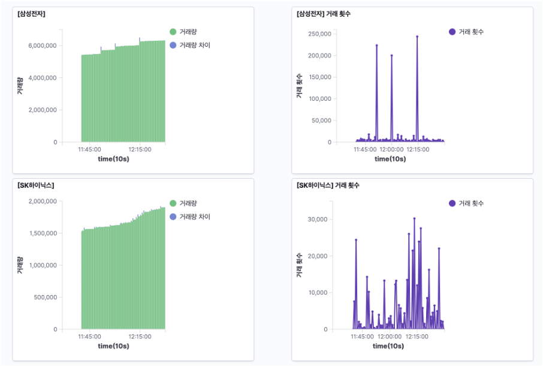

# ELK를 이용한 주식데이터 분석

## 프로젝트 소개
ELK를 이용하여 특정 종목의 주가 조작을 분석한다. 
## 기술 스택
    

## 구조
#### 1. 네이버 증권 스크래핑
* R 이용
* 네이버 증권의 주식데이터를 9:00 ~ 15:00 동안 10초 간격으로 스크래핑
* 아래의 네이버 주식 페이지에서 스크래핑을 진행

#### 2. 로그스태시를 이용한 로그데이터 정제
* 로그스태시를 이용하여 R에서 제공한 데이터프레임을 엘라스틱서치 Document형식에 맞게 정제
* 로그스태시를 거친 후에 엘라스틱서치에 실시간 주식 데이터를 저장
  
#### 3. 키바나를 이용한 시각화
* Elasticsearch, kibana 이용
  ##### Elasticsearch
  * 현재 거래량과 10초 전의 거래량 차이 계산
  
  ##### Kibana
  * Elasticsearch를 통해 계산된 결과를 시각화
  * 거래량 및 거래량 차이 변화를 실시간으로 확인 가능
  
  
#### 4. 스프링부트를 이용하여 클라이언트에게 실시간 거래량 차이 제공
* 스프링부트 서버를 엘라스틱 서버와 연동
* 클라이언트가 원하는 종목을 입력 시, 스프링부트 서버가 실시간으로 거래량 10초 전과의 거래량 차이 제공
  
* 거래량이 급격히 증가하는 경우, 클라이언트에게 알림

